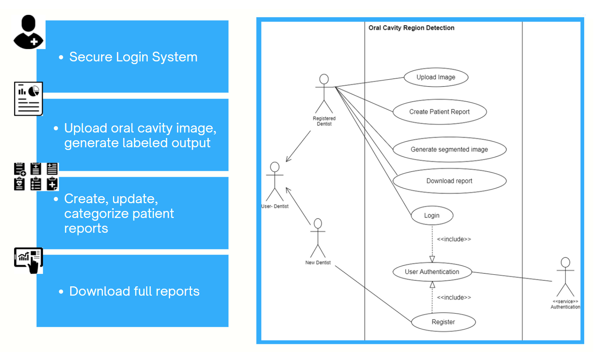

___
# Oral Cavity Region Detection System
___

## Introduction

This project contains a web-based application that can be used to upload images of the oral cavity and identify the known regions which are normal. For example: The tool will process an image uploaded by the clinician and apply masks to easily recognize a specific region of the oral cavity which does not indicate any abnormality.

### Why

If known regions are quickly detected using a methodology, without patient having to endure prolonged invasions to the oral cavity, the dentists can easily identify the abnormal regions and pay more attention to the undetected oral lesions/ suspected regions in a matter of seconds.

On the other hand, AI detection systems that are used to detect oral cancers require oral cavity images with only the lesion component. Therefore, the output masks of our tool can be used to filter out the lesion part and feed it to the cancer detection tools.

## System Architecture

## Use Case Diagram

