[comment]: # "This is the standard layout for the project, but you can clean this and use your own template"

# Oral Cavity Region Detection Tool

---

## Team
-  e17058, Devindi G.A.I, [e17058@eng.pdn.ac.lk](mailto:name@email.com)
-  e17090, Francis F.B.A.H, [e17090@eng.pdn.ac.lk](mailto:name@email.com)
-  e17190, Liyanage S.N, [e17190@eng.pdn.ac.lk](mailto:name@email.com)

<!-- Image (photo/drawing of the final hardware) should be here -->

<!-- This is a sample image, to show how to add images to your page. To learn more options, please refer [this](https://projects.ce.pdn.ac.lk/docs/faq/how-to-add-an-image/) -->

<!--  -->

#### Table of Contents
1. [Introduction](#introduction)
2. [Solution Architecture](#solution-architecture )
3. [Software Design](#software-design)
4. [Machine Learning Model](#machine-learning-model)
5. [Links](#links)

## Introduction

This project contains a web-based application that can be used to upload images of the oral cavity and identify the known regions which are normal. For example: The tool will process an image uploaded by the clinician and apply masks to easily recognize a specific region of the oral cavity which does not indicate any abnormality.

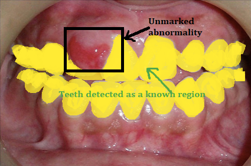

### Why

If known regions are quickly detected using a methodology, without patient having to endure prolonged invasions to the oral cavity, the dentists can easily identify the abnormal regions and pay more attention to the undetected oral lesions/ suspected regions in a matter of seconds.

On the other hand, AI detection systems that are used to detect oral cancers require oral cavity images with only the lesion component. Therefore, the output masks of our tool can be used to filter out the lesion part and feed it to the cancer detection tools.

## Solution Architecture

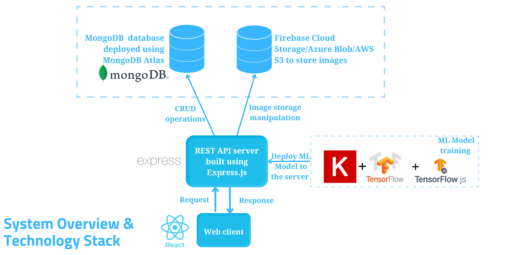

## Use Case Diagram

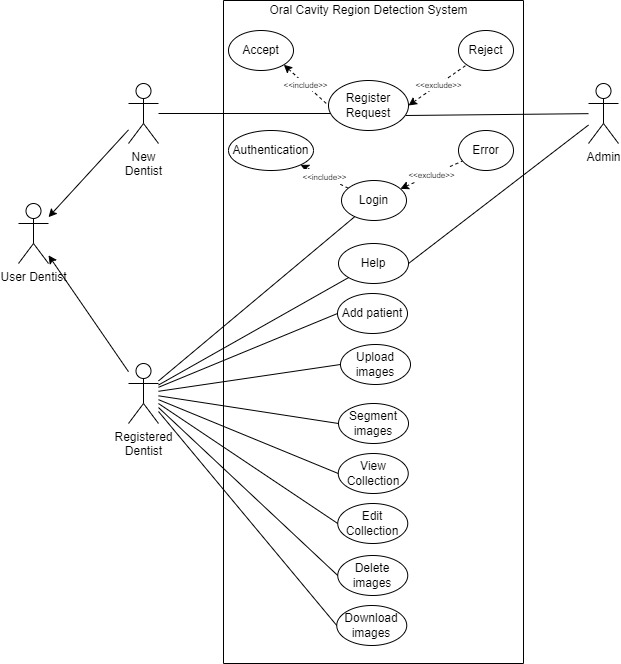

## UML Class Diagram
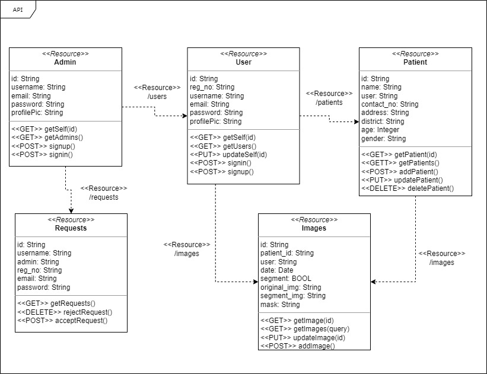

## Software Design

### User Interface for Dentists

Web application mainly consists of 4 pages,
    
1. Login Page
    * Managing User login with the email and the password.
2. Signup Page
    * Managing a signup of a  new user to the system with relevant details
3. Image Collection and Upload Page
    * Managing the image database of the user and the image upload functionality. 
    * Provide filters to categorize images based on different criteria(Age,ID  , District)
4. Work Place Page
    * Main workplace of the tool
    * Running the algorithm on an image set.
    * previewing masked images

See the prototype of the web interface [here](https://www.figma.com/proto/4IeXgo5tZhL59J8Hi59KgF/6SP-Oral-Cavity-Detection?page-id=0%3A1&node-id=36%3A85&viewport=241%2C48%2C0.47&scaling=contain&starting-point-node-id=36%3A85)

**Wire frame Diagram for the Web 
application**

**Login Page (Implemented)**

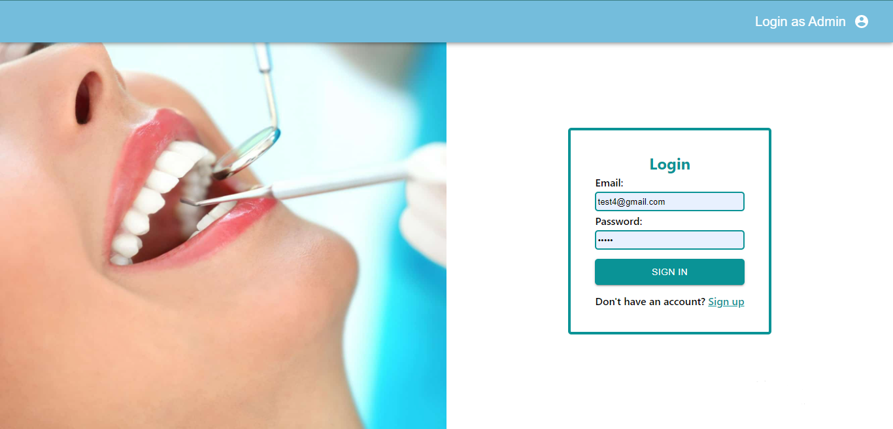

**Signup Page (Implemented)**

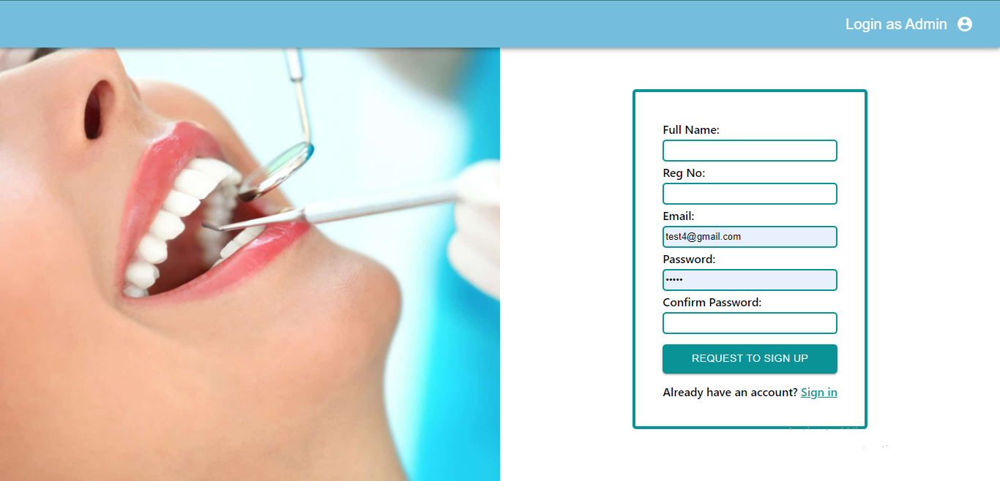

**Collection & Upload Page (Wireframe)**

**Work Place Page (Wireframe)**

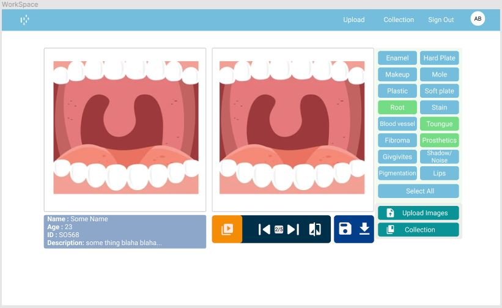

### User Interface for Administrators
The Administrators's portal have the following functionalities.
1. Login Page
2. Accept registration requests of the authorized Dentists

**Portal showing the registration requests (Implemented)**
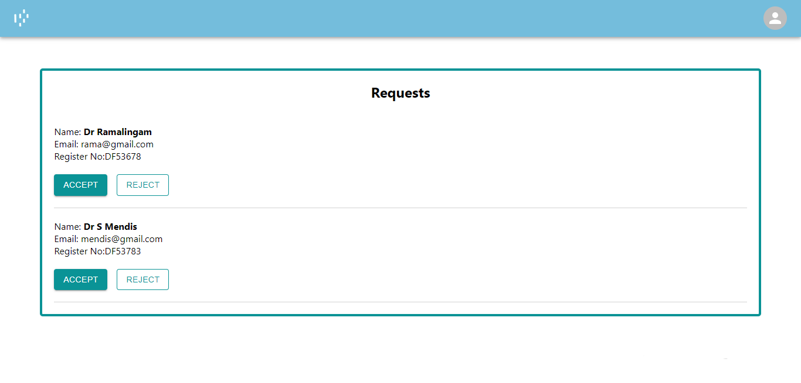

## Machine Learning Model

A machine learning model is built to identify and correctly segment the known, normal regions of an Oral Cavity image.

The process of building the model is devided into 8 phases as shown in the below figure
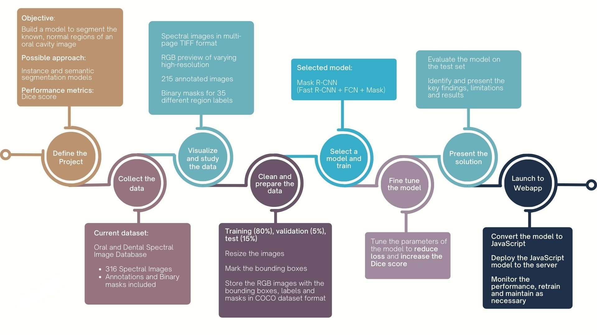

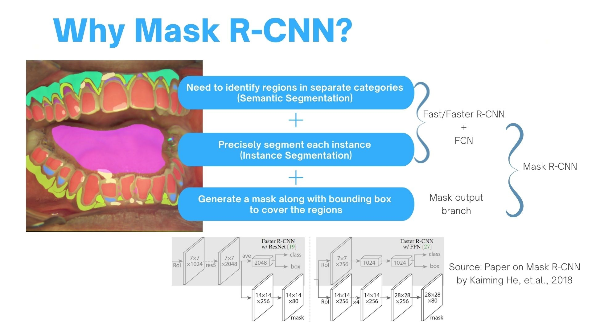

## Release Plan

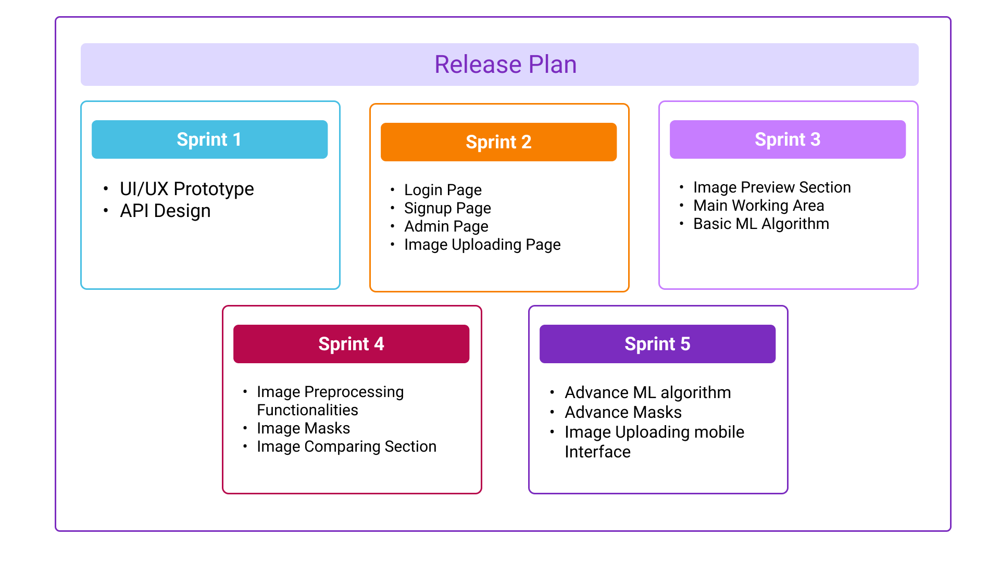

<!--## Testing

Testing done on hardware and software, detailed + summarized results-->

<!--## Detailed budget

All items and costs

| Item          | Quantity  | Unit Cost  | Total  |
| ------------- |:---------:|:----------:|-------:|
| Sample item   | 5         | 10 LKR     | 50 LKR |
-->
<!--## Conclusion

What was achieved, future developments, commercialization plans-->

## Links

- [Project Repository](https://github.com/cepdnaclk/e17-co328-Oral-Cavity-Region-Detection)
- [Project Page](https://cepdnaclk.github.io/e17-co328-Oral-Cavity-Region-Detection)
- [Department of Computer Engineering](http://www.ce.pdn.ac.lk/)
- [University of Peradeniya](https://eng.pdn.ac.lk/)

[//]: # (Please refer this to learn more about Markdown syntax)
[//]: # (https://github.com/adam-p/markdown-here/wiki/Markdown-Cheatsheet)
