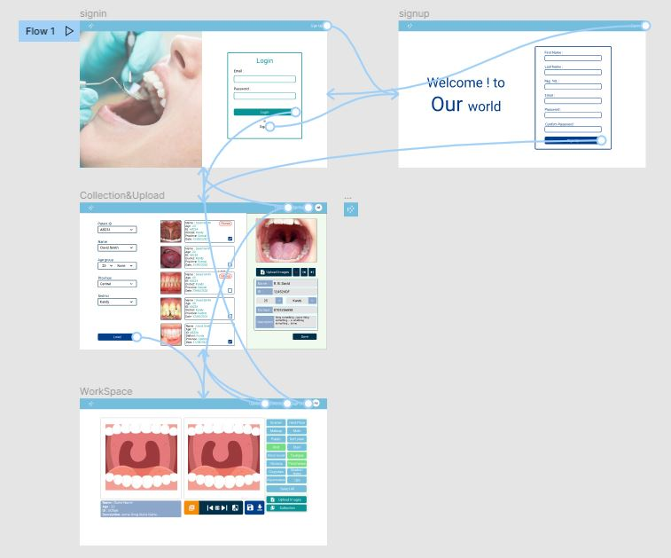
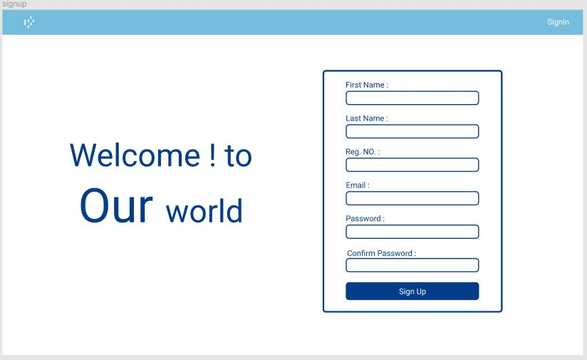
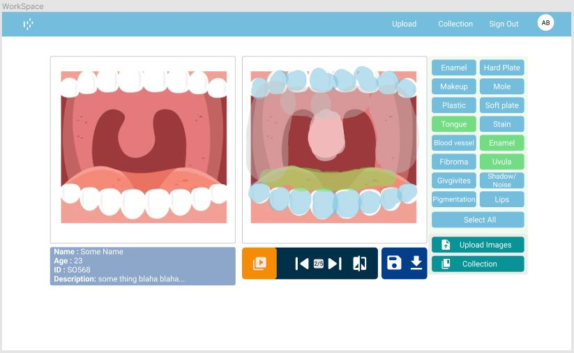

Web application mainly consists of 4 pages,
    
1. Login Page
    * Managing User login with the email and the password.
2. Signup Page
    * Managing a signup of a  new user to the system with relevant details
3. Image Collection and Upload Page
    * Managing the image database of the user and the image upload functionality. 
    * Provide filters to categorize images based on different criteria(Age,ID  , District)
4. Work Place Page
    * Main workplace of the tool
    * Running the algorithm on an image set.
    * previewing masked images

See the prototype of the web interface [here](https://www.figma.com/proto/4IeXgo5tZhL59J8Hi59KgF/6SP-Oral-Cavity-Detection?page-id=0%3A1&node-id=36%3A85&viewport=241%2C48%2C0.47&scaling=contain&starting-point-node-id=36%3A85)

**Wire frame Diagram for the Web 
application**

**Login Page**

**Signup Page**

**Collection & Upload Page**

**Work Place Page**

